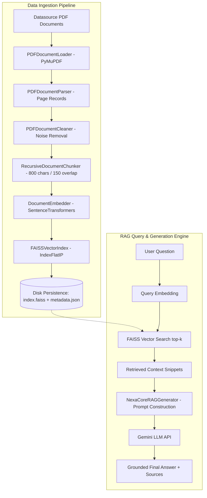

# Project 1: NexaCore Semantic Document Search (Basic Dense RAG)

> **Level:** Level 1 — Basic  
> **RAG Type:** Dense RAG  
> **Frameworks & Technologies:** Python, PyMuPDF, Sentence Transformers, FAISS, Google Gemini API, NumPy  

---

## 📌 Project Overview

**NexaCore Semantic Document Search** is a production-grade, end-to-end **Dense Retrieval-Augmented Generation (Dense RAG)** system designed to ingest enterprise PDF documents, clean and structure raw content, generate high-dimensional vector embeddings, index them using **FAISS**, and perform semantic context retrieval to generate grounded answers using Google's **Gemini LLM**.

This repository represents **Project 1** in the RAG Masterclass series, establishing core concepts of vector space modeling, text chunking, vector indexing, dense retrieval, and context-conditioned prompt generation.

---

## 🛠️ Main Concepts Covered

| Concept Category | Detailed Description | Implementation File |
| :--- | :--- | :--- |
| **Document Loading** | Directory scanning, recursive `.pdf` discovery, subfolder category tagging (e.g., HR, Engineering), PyMuPDF handle lifecycle management. | [`document_loader.py`](file:///d:/RAG/Semantic_Document_Search/document_loader.py) |
| **Document Parsing** | Page-by-page text extraction, page number indexing, and structured page record creation. | [`document_parser.py`](file:///d:/RAG/Semantic_Document_Search/document_parser.py) |
| **Document Cleaning** | Structure-preserving text normalization, whitespace standardization, header/footer noise removal, and pre/post character count tracking. | [`document_cleaner.py`](file:///d:/RAG/Semantic_Document_Search/document_cleaner.py) |
| **Chunking Strategies** | Implementation of **Fixed-size**, **Sentence-boundary**, and **Recursive Character Chunking** (`chunk_size=800`, `chunk_overlap=150`) to preserve semantic coherence across chunk boundaries. | [`document_chunker.py`](file:///d:/RAG/Semantic_Document_Search/document_chunker.py) |
| **Embedding Fundamentals** | Generating 384-dimensional dense vector embeddings using `SentenceTransformers` (`all-MiniLM-L6-v2`) with explicit $L_2$ normalization. | [`document_embedder.py`](file:///d:/RAG/Semantic_Document_Search/document_embedder.py) |
| **Cosine Similarity Search** | High-performance vector index using FAISS `IndexFlatIP` (Inner Product) paired with $L_2$-normalized vectors, guaranteeing exact Cosine Similarity matches. | [`faiss_indexer.py`](file:///d:/RAG/Semantic_Document_Search/faiss_indexer.py) |
| **Dense Retrieval** | Top-$k$ nearest neighbor search with metadata payload preservation and optional category filtering. | [`retriever.py`](file:///d:/RAG/Semantic_Document_Search/retriever.py) |
| **RAG Answer Generation** | Grounded answer generation using Gemini LLM with context snippet formatting, prompt engineering, and citation/source attribution. | [`rag_generator.py`](file:///d:/RAG/Semantic_Document_Search/rag_generator.py) |

---

## 📐 Mathematical Foundation: Cosine Similarity in FAISS

Vector search in this project relies on **Cosine Similarity**. Under the hood, FAISS uses an **Inner Product (`faiss.IndexFlatIP`)** index. 

### Why Inner Product equals Cosine Similarity
Cosine Similarity between two vectors $\mathbf{u}$ and $\mathbf{v}$ is defined as:
$$\text{Cosine Similarity}(\mathbf{u}, \mathbf{v}) = \frac{\mathbf{u} \cdot \mathbf{v}}{\|\mathbf{u}\|_2 \|\mathbf{v}\|_2}$$

During vector generation and index insertion:
1. Embeddings are $L_2$-normalized: $\|\mathbf{u}\|_2 = 1$ and $\|\mathbf{v}\|_2 = 1$.
2. The inner product simplifies directly to Cosine Similarity:
$$\mathbf{u} \cdot \mathbf{v} = \text{Cosine Similarity}(\mathbf{u}, \mathbf{v})$$

This approach combines the maximum performance of matrix multiplication in FAISS with exact cosine similarity scores ranging from `-1.0` to `1.0`.

---

## 🏗️ Architecture & Pipeline Flow



---

## 📁 Repository Directory Structure

```text
d:\RAG\Semantic_Document_Search\
├── document_loader.py      # Discovers & opens PDF files recursively with metadata
├── document_parser.py      # Page-by-page raw text & page count extractor
├── document_cleaner.py     # Whitespace normalization & header/footer cleaner
├── document_chunker.py     # Fixed, Sentence, and Recursive Chunkers
├── document_embedder.py    # Dense vector embedding generator (384d)
├── faiss_indexer.py        # FAISS IndexFlatIP store (save/load/search)
├── retriever.py            # High-level SemanticRetriever interface
├── rag_generator.py        # Context prompt builder & Gemini LLM generator
├── pipeline_runner.py     # Full end-to-end ingestion & indexing pipeline runner
├── query_runner.py        # Standalone RAG query execution script
└── README.md               # Project documentation
```

---

## 🚀 Quick Start Guide

### 1. Environment Setup

Ensure Python 3.10+ is installed. Install required packages:

```bash
pip install pymupdf sentence-transformers faiss-cpu google-genai numpy python-dotenv
```

Configure your Gemini API key in the root `.env` file:

```env
GEMINI_API_KEY="your_actual_gemini_api_key_here"
```

### 2. Run the Data Ingestion & Indexing Pipeline

Execute `pipeline_runner.py` to process all PDF documents in the `Datasource` folder and build the FAISS index:

```bash
python Semantic_Document_Search/pipeline_runner.py
```

**Output Steps:**
1. Loads PDFs from `Datasource/` (categorized by subfolders).
2. Parses page text and metadata.
3. Cleans text while tracking character count statistics.
4. Generates overlapping chunks (`chunk_size=800`, `chunk_overlap=150`).
5. Generates $L_2$-normalized vector embeddings.
6. Saves `index.faiss` and `metadata.json` to `faiss_index/`.

### 3. Query the Dense RAG System

Run `query_runner.py` to ask questions against the indexed knowledge base:

```bash
python Semantic_Document_Search/query_runner.py
```

Or run interactively in Python:

```python
from query_runner import NexaCoreRAGQueryEngine

# Initialize query engine (automatically loads faiss_index from disk)
engine = NexaCoreRAGQueryEngine(provider="gemini")

# Execute query
answer = engine.query(
    question="What is the policy for reimbursement of business travel meals?",
    top_k=3,
    category_filter="hr" # Optional category filter
)
```

---

## 📊 Summary Statistics & Verification

When running `pipeline_runner.py`, the system outputs detailed pipeline metrics:

* **Document Page Count by Category**
* **Character Statistics** (Raw vs. Cleaned)
* **Chunking Metrics** (Total Chunks, Avg Chunk Length)
* **FAISS Index Stats** (Total Indexed Vectors, Vector Dimension = 384)

---

## 📝 License & Attribution

Developed as part of the **NexaCore Semantic Document Search Architecture** — Project 1 (Basic Dense RAG). Created for modularity, clean code principles, and cross-platform compatibility.
